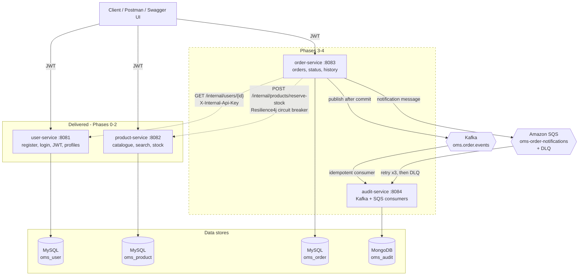
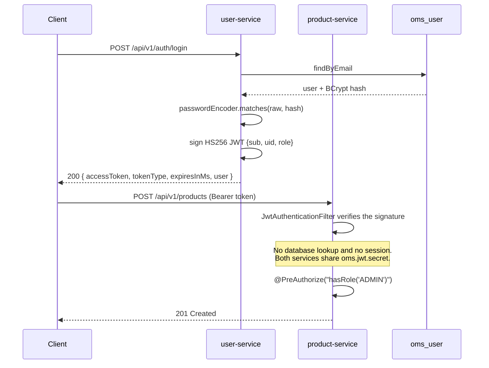
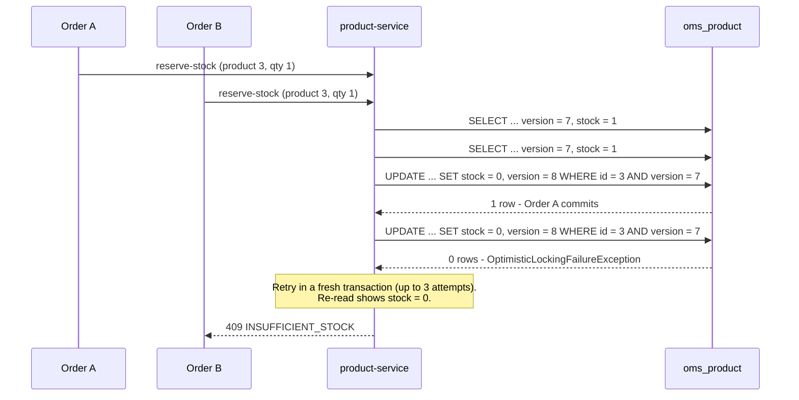
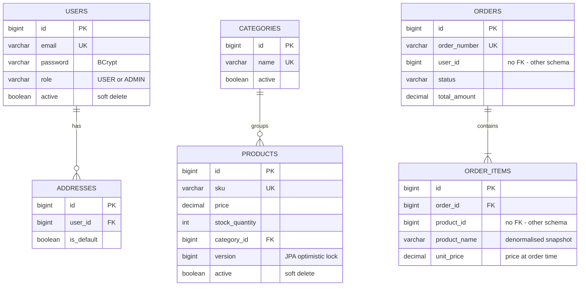

# Architecture

## Service topology

**Every service owns exactly one schema.** No service reaches into another's tables;
cross-service reads go through the `/api/v1/internal/**` endpoints, which are guarded
by a shared key and would not be routed publicly in a real deployment.

`oms-common` is a plain library, not a service: DTO envelope, exception hierarchy and
handler, JWT components, correlation-id and request logging filters, Kafka event models.

---

## Authentication flow

product-service verifies tokens it never issued. That is the whole point of a signed
JWT: user-service is not on the critical path for any other service's authorisation.

---

## Concurrent stock reservation

The case that matters: two orders for the last unit, arriving at the same moment.

Two details that make this correct rather than merely plausible:

- The retry loop sits **outside** the transaction. A failed optimistic lock marks the
  transaction rollback-only, so the row has to be re-read in a new one. That is why
  `ProductServiceImpl` uses `TransactionTemplate` rather than `@Transactional` — a
  self-invocation would bypass the proxy and silently run without a retry.
- Duplicate lines for the same product are merged before any decrement, so one request
  never races itself.

---

## Entity relationships

`USERS`/`ADDRESSES` live in `oms_user`, `CATEGORIES`/`PRODUCTS` in `oms_product`, and
`ORDERS`/`ORDER_ITEMS` in `oms_order`. The two relationships that cross a schema
boundary carry no foreign key by design — enforcing them in the database would couple
services that are meant to deploy independently.

---

## Request lifecycle

```mermaid
flowchart LR
    R[Request] --> CID[CorrelationIdFilter<br/>MDC + response header]
    CID --> RL[RequestLoggingFilter<br/>one line in, one out]
    RL --> JWT[JwtAuthenticationFilter<br/>populates SecurityContext]
    JWT --> SEC[authorizeRequests<br/>path rules]
    SEC --> INT[InternalApiKeyInterceptor<br/>/api/v1/internal/** only]
    INT --> PRE["@PreAuthorize<br/>role and ownership"]
    PRE --> VAL["@Valid<br/>Bean Validation"]
    VAL --> CTRL[Controller]
    CTRL --> SVC["Service @Transactional"]
    SVC --> REPO[Repository]

    CTRL -.throws.-> GEH[GlobalExceptionHandler]
    SVC -.throws.-> GEH
    REPO -.throws.-> GEH
    GEH --> RESP[ApiResponse with the right status]
```

Anything thrown at any layer lands in one `@RestControllerAdvice`, so no controller
contains a try/catch and every failure reaches the client in the same envelope.
